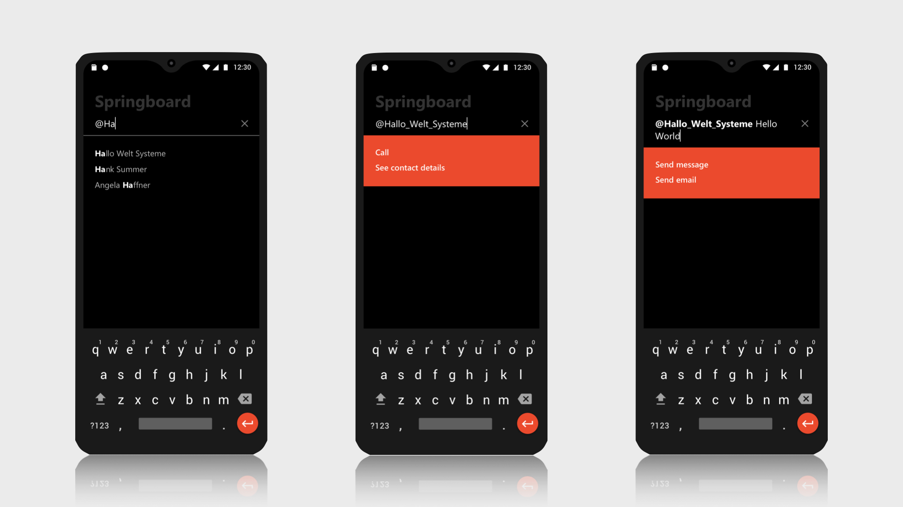
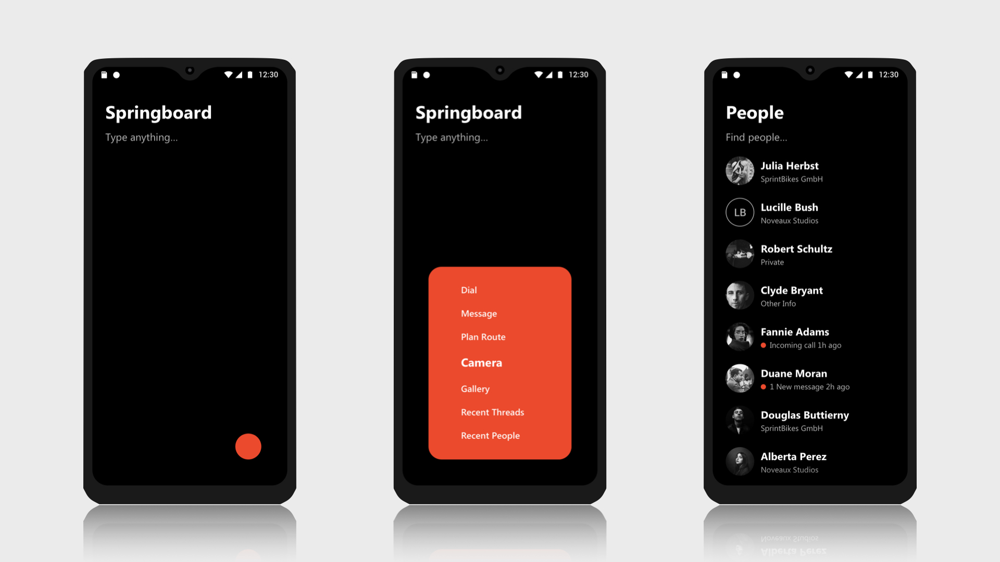

# Volla OS Beta Leitfaden

Die Beta-Version des Volla OS ist noch unvollständig und beinhaltet Fehler. Einen Überblick über den Entwicklungsstand finden Sie auf der Plattform Github, auf wir dem Quellcode des Betriebssystems veröffentlichen. 

https://github.com/HelloVolla/

In dem Repositorium [volla-os-beta-test](https://github.com/HelloVolla/volla-os-beta-test) finden Sie neben dieser Anleitung auch die Möglichkeit Fehler zu melden und deren Behebung zu verfolgen. 

https://github.com/HelloVolla/volla-os-beta-test/issues

Wenn Sie das Volla Phone mit einem Volla OS Betriebssystem entsperren, gelangen Sie zum Volla Launcher, den Sie die Grundfunktionen des Gerätes einschließlich das Öffnen von Apps ausführen können. 

Sie erreichen den Volla Launcher auch durch die Home Schaltfläche an der unteren Seite der Anzeige oder durch die entsprechende Wischgeste von der unteren Außenseite der Anzeige in den Innenbereich.

Das vollständige Ausblenden der Android Navigationsleiste ist in der Beta Version des Volla OS noch nicht umgesetzt.

Die Volla Benutzeroberfläche umfasst zwei Grundkonzepte:

1. Sprungbrett mit
	2. Textfeld und
	3. Kurzbefehlen
3. Sammlungen für
	4. Kontakte
	5. Unterhaltungen
	6. Nachrichten

## Sprungbrett

Immer wenn Sie den Volla Launcher aufrufen, zeigt dieser das Sprungbrett. Die Idee ist, dass Sie etwas schreiben und das System erkennt, was Sie zum wollen. Dafür liefert es Vorschläge zur Vervollständigung Ihrer Eingabe oder passende Funktionen für Ihre Eingabe.

Das Sprungbrett unterstützt folgende Anwendungsfälle:

### Kontaktauswahl
Wenn Sie die Eingabe mit dem @-Zeichen beginnen, erkenn das System, dass Sie einen Namen eingeben wollen und schlägt Personen aus em Adressbuch vor, die vorläufig nach Namen sortiert sind. Tippen Sie auf einen Namen in der List, wird dieser im Textfeld übernommen. Voraussetzung für diese Funkton ist, dass sich In Ihrem Adressbuch Einträge befinden.

Sie können Kontakt beispielsweise mit der installierten App für die Synchronisation von Adressbüchern und Kalender über das CardDAV und CalDAV Protokoll synchronisieren.

### Anruf
Anschließend schlägt das System vor, dass Sie diese Person anrufen. Wenn Sie auf den Vorschlag für diese Funktion tippen, ruft das System die Telefonie-App auf. Vorschläge für Funktionen erkennen Sie im Unterschied zu Vorschlägen zur Vervollständigung Ihrer Eingabe and der roten Hintergrundfarbe.

	@Claudia_Sommer

### Mitteilungen
Wenn Sie anstatt einen Anruf auszulösen weitere Worte eingeben, schlägt das System vorn, dass Sie dem eingegebenen Kontakt eine Kurzmitteilung oder E-Mail senden können. Tippen Sie auf den Vorschlag öffnet die App aktuell noch die jeweilige App mit eine vorausgefüllten Mitteilung, die Sie nur noch absenden müssen. 

	@Claudia Sommer Kommst Du mit uns zum Italiener in der Mittagspause?

Verwenden Sie einen Zeilenumbruch nach den Worten, verwendet das System die erste Zeile für den Betreff einer E-Mail. Voraussetzung ist, dass Sie mindestens ei E-Mail-Konto angelegt haben.

	@Claudia_Sommer Mittagspause
	Hast Du Lust in der Mittagspause mit uns zum Italiener zu gehen?\
	Grüße von Petra

### Web-Suche
Wenn Sie die Eingabe anstatt mit einem Wort anstatt eines Kontaktes starten, schlagt das System vor, mit diesem Wort im Internet zu suchen. Dafür startet das System den Browser mit dem eingegebenen Stichwort. Derzeit verwendet die Beta-Version die Suchmaschine DuckDuckGo. Geplant ist die Auswahl einer Suchmaschine in den Einstellungen.

	Volla
	
### Notiz
Geben Sie mehrere Worte ein, schlägt das System außerdem vor, dass Sie eine Notiz anlegen können. Vorläufig erstellt die Beta-Version eine Textdatei, die Sie mit dem App zur Anzeige Ihrer Dateien im Dokumentenverzeichnis finden und mit  der App für Notizen wieder öffnen und bearbeiten können. 

	Volla Phone
	
Sie können auch Zeilenumbrüche verwenden
	
### Web-Adresse
Wenn Sie eine gültige Internetadresse eingeben, schlägt das System vor, diese im Browser zu öffnen.

	volla.online
	
### Telefonnummer
Wenn Sie das Textfeld eine Telefonnummer eingeben, schlägt Ihnen auch hier Das system vor, einen Anruf auszulösen. In der Beta-Version ist wie bei allen Eingaben ein Leerzeichen am Ende eines Wortes oder eine Ziffernfolge notwendig um die Auswertung der Eingabe anzustoßen.

	014323566777
	
Geben Sie anschließend ein oder mehrere Worte ein, bietet das System an, dass Sie eine Kurzmitteilung senden, noch jedoch eine E-Mail.

	014323565777 Hallo Petra, wie geht es Dir?
	
Weitere Anwendungsfälle sind geplant.

## Kurzbefehle

Auf dem Sprungbrett ist auf ein roter Punkt zu sehen. Mit diem rufen Sie Kurzbefehle mit nur einer Geste auf. Berühren Sie dafür den Punkt, sodass sich das Menü öffnet, schieben Sie den Finger oder Stylus über den gewünschten Menüeintrag und heben Sie den Finger oder Stylus an:

1. Berühren
2. Schieben
3. Loslassen

Die Beta-Version unterstützt festgelegte Funktionen:

- Aufruf von wichtigen Kontakten
- Aufruf von jüngsten Konversationen
- Aufruf von jüngsten Nachrichten
- Aufruf der Kalender App
- Aufruf der Telefon App
- Aufruf der Kamera

Die Auswahl der gewünschten Kurzbefehle ist in den Einstellungen geplant.

## Sammlungen

Die Sammlungen geben Ihnen einen schnellen Überblick über wichtige Informationen und passende Funktionen. Nach dem Aufruf einer Sammlung sehen Sie eine Animation, mit der das System die Sammlung von der rechten Seite einblendet.

Sie können mit eine Wischgeste, dem Home-Button oder der Home-Geste wieder zurück zum Sprungbrett navigieren. 

Jede Sammlung können Sie über ein Textfeld unter der Überschrift filtern.

### Kontakte
Das System stellt automatisch wichtige Kontakte zusammen. In der Beta-Version berücksichtig das System alle Kontakte, die Sie im Adressbuch als Favorit gekennzeichnet haben oder mit der Sie vor kurzem über einen Telefonanruf oder eine SMS oder MMS-Mitteilung in Verbindung standen.

In der Übersicht der Kontakte finden Sie den Namen des Kontaktes sowie dessen Organisation oder die jüngste ungelesene Nachricht oder ein verpasster Anruf. 

Tippen Sie auf einen Eintrag und halten Sie die Berührung eine kurze Zeit öffnet dass System ein Kontextmenü und bietet in Abhängigkeit, des Adressbucheintrags Funktionen für einen Anruf, eine Kurzmitteilung oder eine E-Mail an. Auch hier erfolgt die Auswahl gemäß der Geste für Kurzbefehle.

Tippen Sie nur kurz auf einen Eintrag, öffnet das System die Konversation mit der Person, die vorläufig Anrufe, SMS- und MMS-Mitteilungen enthält.

Eine direkte Antwort in der Konversation ist geplant.

### Konversationen
Hier zeigt das System die jüngste Konversationen mit Name oder Telefonnummer und Text an, die es nach Zeit und Thema sortiert. Die Beta-Version berücksichtigt SMS- und MMS-Mitteilungen. Weitere Kommunikationskanäle sind geplant.

Tippen Sie kurz auf eine Konversation, zeigt das System die Konversation mit allen ausgetauschten Mitteilungen.

### Nachrichten
Hier zeigt das System die jüngsten Nachrichten nach ihrer Quelle gruppiert und nach Zeit sortiert. Das hat den Vorteil, dass wichtige Nachrichten aus Quellen, die seltener Nachrichten veröffentlichen nicht im Nachrichtenstrom untergehen. 

Wenn Sie auf das Symbol des Nachrichtenkanals tippen, gelangen Sie zu allen jüngsten Veröffentlichungen dieses ausgewählten Nachrichtenkanals. 

Tippen Sie hingegen auf die angezeigte Nachricht, gelangen Sie zu der vollständigen Nachricht, die das System für eine optimale Lesbarkeit aufbereitet.

Die Beta-Version berücksichtigt beispielhaft den RSS-Feed von drei Nachrichtenkanälen. Geplant ist die Eistellung selbst ausgesuchter RSS-Feeds sowie weitere Nachrichtenkanäle wie Twitter.

## Apps

Wenn Sie vom Sprungbrett aus eine Wischgeste nach rechts ausführen gelangen Sie zur Übersicht der installierten Apps, die das System in der Beta-Version nach deren Namen alphabetisch sortiert. 

Auch hier können sie die angezeigten Elemente mit einem Textfeld filtern.

Ein roter Punkt deutet an, ob Sie eine Anruf verpasst habe oder eine Kurzmitteilung och nicht gelesen haben.

## Einstellungen

Wenn Sie vom App-Gitter aus eine Wischgeste nach rechts ausführen gelangen Sie zu den Einstellungen der App. 

Die erste Beta-Version unterstützt ausschließlich die Auswahl des Gestaltungsthemas. 

- Dunkler Modus
- Heller Modus
- Durchsichtiger Modus

Der durchsichtige Modus verwendet das Hintergrundbild, dass Sie in den Systemeinstellungen verändern können.

## Standard Apps

Das Volle OS kommt ohne Google Apps und Play Services, um die Privatsphäre der Anwender zu schützen. Daher enthält es kuratierte, quelloffene Alternativen. Siehe hierzu auch die entsprechende Übersicht. 

https://github.com/HelloVolla/volla-os-beta-test/wiki/Curated-Pre-Installed-System-Apps

Zu Auswahl ist noch nicht final. 

## Verschiedenes

Auch dieses Dokument wird überarbeitet werden. Allgemeine Fragen und Anregungen sind über unser Kontaktformular oder über die Volla Beta-Tester Gruppe auf Telegram willkommen:

https://volla.online/contact-form/

Für die Einladung in die Telegram Gruppe für die Beta-Tester, bitte Marc Aurel mit der Adresse @m_aurel anschreiben.